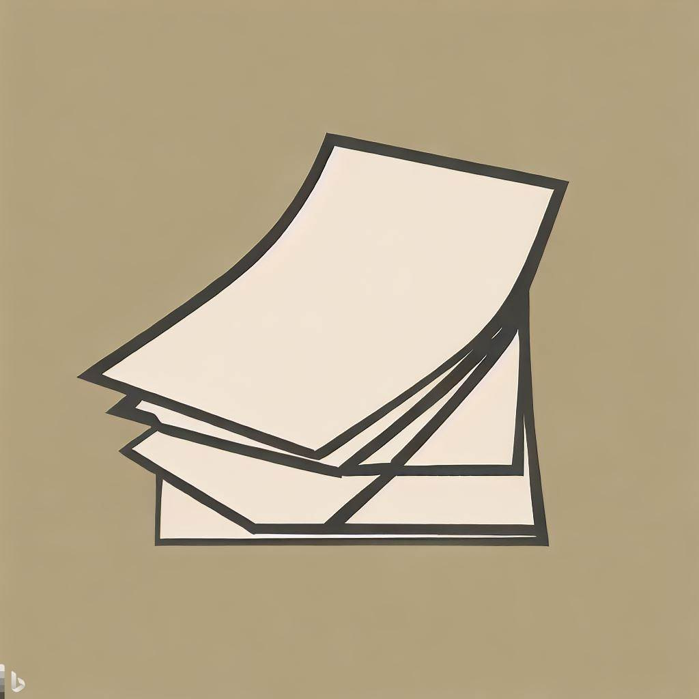
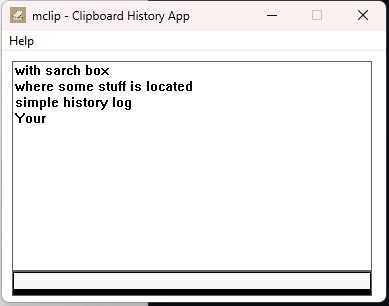

# (micro) clipboard history app **'mclip'**
Bare minimum clipboard history application. Using only Win32 API.  
Logs every CTRL-C call, and shows content in Listbox window.  

## Requirement
Created with:  
 - Microsoft (R) C/C++ Optimizing Compiler Version 19.36.32532 for x64

## Installation
1. Clone repository
2. Adjust *build.bat* to your local environement variables and path. 
4. If everything goes well *\build* directory will contain final binary.  

Or use binary available in build directory.  

## Disclaimer
~~Probably~~ Contains bugs.   
Only real customization option is basially MAX_HISTORY macro. Currently set to 25 entries.  
Total time spent was 2.5h, with the help of LLM's! 

# TODO 
- ~~Add search box to filter items for substring - currently bug for filtered listbox.~~
- Ability to change number of history items from the application itself.
- Todo: Hotkeys currently mapped to ALT + VK_OEM_1 -- lookup what is it in your country.

## Changelog
 - 0.4.2 - added handling of Access Denied on Clipboard, with retries (simple, no exponential back off).

## Licence
MIT 

Copyright (c) Ilija Tatalovic, 2023.

Permission is hereby granted, free of charge, to any person obtaining a copy
of this software and associated documentation files (the "Software"), to deal
in the Software without restriction, including without limitation the rights
to use, copy, modify, merge, publish, distribute, sublicense, and/or sell
copies of the Software, and to permit persons to whom the Software is
furnished to do so, subject to the following conditions:

The above copyright notice and this permission notice shall be included in all
copies or substantial portions of the Software.

THE SOFTWARE IS PROVIDED "AS IS", WITHOUT WARRANTY OF ANY KIND, EXPRESS OR
IMPLIED, INCLUDING BUT NOT LIMITED TO THE WARRANTIES OF MERCHANTABILITY,
FITNESS FOR A PARTICULAR PURPOSE AND NONINFRINGEMENT. IN NO EVENT SHALL THE
AUTHORS OR COPYRIGHT HOLDERS BE LIABLE FOR ANY CLAIM, DAMAGES OR OTHER
LIABILITY, WHETHER IN AN ACTION OF CONTRACT, TORT OR OTHERWISE, ARISING FROM,
OUT OF OR IN CONNECTION WITH THE SOFTWARE OR THE USE OR OTHER DEALINGS IN THE
SOFTWARE.

